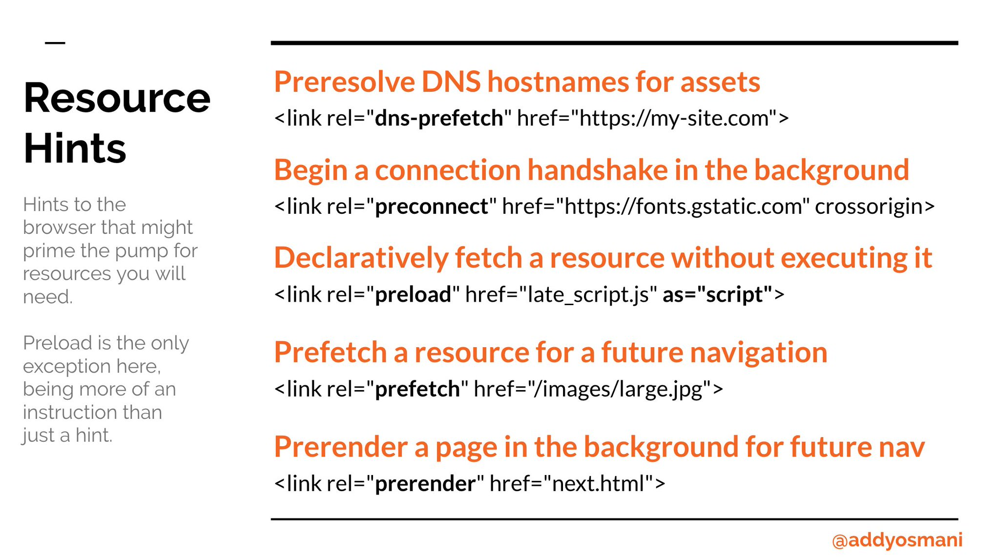

<!-- .slide: data-background="./images/hero_bg.jpg" -->
<h1 class="title dark-background"><span class="translucent">The Future of</span> Front-End Performance</h1>
<h2 class="subtitle">Sia Karamalegos</h2>

---

## hi, i'm sia

[sia.codes](https://sia.codes/)


---

## [bit.ly/perf-90](http://bit.ly/perf-90)

---

## Take out a piece of paper...


---

<!-- .slide: data-background="./images/elevator2.jpg" -->
<h1 class="dark-background">
  <span class="highlighter">Why do elevators have mirrors?</span>
</h1>

---

# Why Should I Care?

---

> Pinterest reduced load times by 40% and saw a 15% increase in sign ups.

<small>https://wpostats.com/</small>

---

> Starbucks implemented a 2x faster time to interactive resulting in a 65% increase in rewards registrations.

<small>[Chrome Dev Summit 2018](https://www.youtube.com/watch?v=Xryhxi45Q5M&t=1113s&index=6&list=PLNYkxOF6rcIDjlCx1PcphPpmf43aKOAdF )</small>

---

> AliExpress reduced load by 36% and saw a 10.5% increase in orders.

<small>https://wpostats.com/</small>

---

> Speed is now used as a ranking factor for mobile searches.

<small>https://developers.google.com/web/updates/2018/07/search-ads-speed</small>

Note: In 2016, Doubleclick by Google released a report saying that 53% of mobile sites are abandoned if pages take longer than 3 seconds to load.

---


<small>[Moving towards a faster web](https://blog.chromium.org/2019/11/moving-towards-faster-web.html)</small>

---

The internet consumes 416.2 TWh of electricity per year. A 10% savings would be equivalent to:

- 6.2 million fewer cars on the road 🚗 <!-- .element: class="fragment fade-in-then-semi-out" -->
- 32 billion less pounds of coal being burned 💨 <!-- .element: class="fragment fade-in-then-semi-out" -->
- 486 million tree seedlings grown for 10 years 🌳 <!-- .element: class="fragment fade-in-then-semi-out" -->

<small>[How is your website impacting the planet?](https://www.websitecarbon.com/), [Greenhouse Gas Equivalencies Calculator](https://www.epa.gov/energy/greenhouse-gas-equivalencies-calculator)</small>

Note: Most of the energy is consumed by the network and data center, not users' devices.

---

<h1 style="font-size:2.4em;"> 🧪 Test Environments 🧪 </h1>

---

## Testing Environments

<br>

<table class="fixed-two-column" id="invisible-gridlines">
  <thead>
    <tr>
      <th>Lab/Synthetic</th>
      <th>Field/Real User Monitoring (RUM)</th>
    </tr>
  </thead>
  <tbody>
    <tr>
      <td>
        <ul class="plus-minus" style="display:inline;">
          <li class="plus">Controlled environment</li>
          <li class="plus">Predefined network and device settings</li>
          <li class="plus">Reproducible for better performance debugging</li>
          <li class="minus">May not capture real-world bottlenecks</li>
        </ul>
      </td>
      <td>
        <ul class="plus-minus" style="display:inline;">
          <li class="plus">Performance data from <strong>real user page loads</strong> and interactions</li>
          <li class="minus">Limited data and performance debugging capability</li>
      </td>
    </tr>
  </tbody>
</table>

---

## New Lab Testing Tools/Features

- [Render-blocking JS and CSS flags](https://sia.codes/posts/render-blocking-resources/#how-do-i-test-my-website-for-render-blocking-resources%3F) in Webpagetest
- [Lighthouse Treemap](https://sia.codes/posts/lighthouse-treemap/)
- [Lighthouse user flows](https://web.dev/lighthouse-user-flows/)
- Chrome Dev Tools [recorder panel](https://developer.chrome.com/blog/new-in-devtools-97/#recorder) ([video](https://twitter.com/addyosmani/status/1465221489209319428))

---

## More focus on real user data

- [Web Vitals Report](https://web-vitals-report.web.app/) + [web-vitals npm package](https://github.com/GoogleChrome/web-vitals)
- Many analytics vendors ([Speedcurve](https://www.speedcurve.com/), [Calibre](https://calibreapp.com/))
- Starting to be bundled in more general analytics/deployment products like [Layer 0](https://www.layer0.co/performance-monitor)
- [Reporting API](https://developer.mozilla.org/en-US/docs/Web/API/Reporting_API)

---

# 📈 Metrics 📈

---

> When optimizing for speed, <br>**user experience** should always <br>be your primary metric.

---

## User experience

1. When can I see the page? <!-- .element: class="fragment fade-in-then-semi-out" -->
2. When can I interact with it? <!-- .element: class="fragment fade-in-then-semi-out" -->
3. Is it delightful? <!-- .element: class="fragment fade-in-then-semi-out" -->

---

## Core Web Vitals


<small>[Web Vitals](https://web.dev/vitals/), [The Science Behind Web Vitals](https://blog.chromium.org/2020/05/the-science-behind-web-vitals.html)</small>

Note: Target is 75% of loads. "Core Web Vitals are the subset of Web Vitals that apply to all web pages, should be measured by all site owners, and will be surfaced across all Google tools. Each of the Core Web Vitals represents a distinct facet of the user experience, is measurable in the field, and reflects the real-world experience of a critical user-centric outcome." Note modifications over time to improve.

---

## New metrics under evaluation

*Provide feedback now!*

- [Smoothness/animation metric](https://web.dev/smoothness/)
- [Better responsiveness metric](https://web.dev/better-responsiveness-metric/)

---

<!-- .slide: data-background="./images/yellow-camera.jpg" -->
<h1 class="title" style="text-align:left;color: rgb(214, 61, 31);">Optimized, <br><span class="translucent">Responsive </span><br>Images</h1>

---

Images account for 45% of the bytes <br>on average needed to load a webpage.

<small>[httparchive.org](https://httparchive.org), October 2021</small>

Note: actually down from 50% - maybe due to increased use of lazy loading

---


<small>[httparchive.org](https://httparchive.org), October 2021</small>

---

## kB by Percentile


<small>[httparchive.org](https://httparchive.org), October 2021</small>

---


"18% of global Android Chrome users have Lite Mode enabled (aka Save-Data)"


<small>https://twitter.com/colinbendell/status/1265675813204172810</small>

Note: true numbers higher https://twitter.com/addyosmani/status/1265677876608655361

---

## Image Goals

1. Users shouldn't download unnecessary bytes 💾 <!-- .element: class="fragment fade-in-then-semi-out" -->
2. Our images should look good 💅🏼 <!-- .element: class="fragment fade-in-then-semi-out" -->
3. Stop the layout shift ✋🏽<!-- .element: class="fragment fade-in-then-semi-out" -->

---

## Responsive &amp; Optimized Toolbox 🧰

- Best file format <!-- .element: class="fragment fade-in-then-semi-out" -->
- Right size and resolution <!-- .element: class="fragment fade-in-then-semi-out" -->
- Art direction <!-- .element: class="fragment fade-in-then-semi-out" -->
- Lazy loading <!-- .element: class="fragment fade-in-then-semi-out" -->

---

<!-- .slide: data-background="./images/disk-drive.jpg" class="dark-highlighter" -->

# File Format <!-- .element: class="dark-background" style="color:#fecf16" -->

---

> Choosing the right image format... can be far more important than any flashy new “responsive image” technique.

<small>Mat Marquis, [Image Performance](https://abookapart.com/products/image-performance)</small>

Note: Responsive Issues Community Group (RICG) chair. Getting the right image format is more important than any responsive image technique.

---

## Raster vs Vector


<small>https://commons.wikimedia.org/wiki/File:Bitmap_VS_SVG.svg</small>

Note: Raster images contain a set of data about a 2D grid of pixels. Vectors are a system of coordinates and "vectors" than can be redrawn at any size. Rasters are good for photo-realism. Raster file formats are really just different compression methods.

---

<svg version="1.1" width="300" height="200" xmlns="http://www.w3.org/2000/svg"><rect width="100%" height="100%" fill="turquoise" /><circle cx="150" cy="100" r="80" fill="rebeccapurple" /><text x="150" y="125" font-size="60" text-anchor="middle" fill="white">SVG</text></svg>

```xml
<svg version="1.1"
     width="300" height="200"
     xmlns="http://www.w3.org/2000/svg">

  <rect width="100%" height="100%" fill="turquoise" />
  <circle cx="150" cy="100" r="80" fill="rebeccapurple" />
  <text x="150" y="125" font-size="60"
        text-anchor="middle" fill="white">SVG</text>
</svg>
```

Note: (vector) - best for limited colors and sharp lines (e.g., logos)

---

## GIF

Just. Don't.

<video controls width="700" autoplay loop>
  <source src="./images/dont.mp4" type="video/mp4">
  Sorry, your browser doesn't support embedded videos.
</video>

Note: (lossy) - fun but terrible. Use SVG or video instead. Inspect this (or on Twitter) and see that's it's video.

---

## PNG: photo-like images with transparency


Note: (lossless) - best for photo-realistic with transparency. **Lossless compression** - like using ZIP for a file but all the data is still saved.

---

## JPG: photo-like images with no transparency


Note: JPG is your photo workhorse. It's a lossy format that was created to compress by hue - in a way that human eyes are less likely to detect, so it's smaller than PNG. Use for all:

---

## Progressive JPG


<small>[What is a progressive JPEG?](https://www.liquidweb.com/kb/what-is-a-progressive-jpeg/) by Liquid Web</small>

Note: hard to tell when an image has actually finished loading. You might even get a bad impression from a website because “the photos look blurry” (while in fact the site was still loading and you only saw a progressive preview of the photos)

---

## WEBP: Best of both worlds


<small>[caniuse](https://caniuse.com/#feat=webp)</small>

Note: WEBP is a new format available on most modern browsers (I'm looking at you, Safari) that combines the best of JPG and PNG with smaller sizes. It's lossy or lossless and supports transparency.

---

## AVIF: The future


<small>[Equal file sizes demo](https://jakearchibald.com/2020/avif-has-landed/#at-equal-file-sizes) by Jake Archibald, [caniuse](https://caniuse.com/avif)</small>

Note: AVIF is an extraction from the keyframes of the now popular video format AV1. Best compression, supports transparency and more.

---

## JPEG XL: The way future


<small>[caniuse](https://caniuse.com/jpegxl)</small>

---

## Cheatsheet

- ✅ SVG: logos and icons <!-- .element: class="fragment fade-in-then-semi-out no-bullet" -->
- ❌ GIF: don't. use jpg for a still or video for animation. <!-- .element: class="fragment fade-in-then-semi-out no-bullet" -->
- ✅ PNG: photo-like images with transparency <!-- .element: class="fragment fade-in-then-semi-out no-bullet" -->
- ✅ JPG: photo-like images with no transparency <!-- .element: class="fragment fade-in-then-semi-out no-bullet" -->
- ✅ WEBP: smaller, but need to serve fallbacks <!-- .element: class="fragment fade-in-then-semi-out no-bullet" -->
- ✅ AVIF: EVEN SMALLER, but need to serve fallbacks <!-- .element: class="fragment fade-in-then-semi-out no-bullet" -->

<small>[Responsive Doggos Demo](https://projects.sia.codes/responsive-images-demo/)</small>

Note: Raster file formats are really just different compression methods. **SVG**: Can style and animate with CSS or make basic edits in XML. **GIF**: huge file sizes for animation, use video instead. svg or jpg are better for stills. Twitter converts GIF to video.  **PNG**: Use jpg if don't need transparency. **JPG**: much better compression algos.

---

# 📺 Size &amp; Resolution 📺

---

## Demystifying DPR (device pixel ratio)

On a 2x screen, a displayed image width of 100px needs a 200px file/natural width image to look good.


Note: n this exaggerated example, the natural width of the bantha doggo on the left is 150px, then 300px, then 600px. The display width is 300px, and my screen has a DPR (device pixel ratio) of 2. 150px is fuzzy. Looking closely, the middle image is not the best quality either.

---

## `srcset`

```html

```

- States a set of images and the natural size of each image <!-- .element: class="fragment fade-in-then-semi-out" -->
- Browser assumes a display width of 100vw <!-- .element: class="fragment fade-in-then-semi-out" -->
- Files are candidates, not commands. <!-- .element: class="fragment fade-in-then-semi-out" -->

Note: States a set of images and the natural size of each image. Browser assumes a display width of 100vw. Files are candidates, not commands.. Alternatively, use x-descriptors.

---

## `sizes`

```html

```

- States display width for a set of media conditions <!-- .element: class="fragment fade-in-then-semi-out" -->
- Order matters! First match is used. <!-- .element: class="fragment fade-in-then-semi-out" -->
- No media condition for the last one (default for no match). <!-- .element: class="fragment fade-in-then-semi-out" -->
- Add analogous CSS. <!-- .element: class="fragment fade-in-then-semi-out" -->

Note: Format is [media condition][space][display width]. Once again, these are candidates, not commands. We are letting the browser choose which file to use ultimately.

---

<!-- .slide: data-background="./images/elder-phone.jpg" -->
<h1 style="text-align:right;">🤔</h1>

Note: How many different resolutions? Science suggests humans can see 720ppi 1 foot from a screen. The iPhone 11 is 326ppi (MBP is 227) so in most cases, you're safe providing only 1x and 2x. You might consider 4x in cases of high-resolution projectors or art.

---


<small><a href="https://twitter.com/TheRealNooshu/status/1397862141894529027">Tweet thread</a> with GOV.UK screen width and DPR data, <a href="https://jakearchibald.com/2021/serving-sharp-images-to-high-density-screens/">Halve the size of images by optimising for high density displays</a></small>

Note: Furthermore, nowadays most mobile screens are 2x and 3x so we can simplify by not providing 1x options at those screen sizes

---

# 🎨 Art Direction 🎨


Note: (1) Art direction is a technique for drawing attention to the most important parts, or targeting specific features of an image, even when it’s viewed on different devices or platforms. (2) So how do we do art direction?

---

## `<picture>`

- Provide multiple images based on device size, resolution, orientation, and more.
- Use `media` attribute for viewport spec. First match is used.
- Always provide `` last for no match or browsers that do not support `<picture>` and `<source>`

```html
<picture>
  <source media="(min-width: 800px)"
          srcset="wide_800.jpg 800w,
                  wide_1600.jpg 1600w">
  <source media="(min-width: 400px)"
          srcset="narrow_400.jpg 400w,
                  narrow_800.jpg 800w">
  
</picture>
```

Note: (1) In this `picture` tag, we have 2 sources and an img. Older browsers simply ignore the picture and source tags and use the img tag. (2) The video tag also works this way and can have multiple `source` tags

---

## Bleeding-Edge File Formats

```html
<picture>
  <source type="image/avif" srcset="pug_life.avif" />
  <source type="image/webp" srcset="pug_life.webp" />
  
</picture>
```

- Browser uses the first compatible file type.
- Set `` `src` to a format supported by all browsers.

Note: Browser uses the first compatible file type. Set `` `src` to a format supported by all browsers.

---

## `webp`, `srcset`, &amp; `sizes`, oh my!

```html
<picture>
  <source srcset="./images/sofa_pug_400.webp 400w,
                  ./images/sofa_pug_800.webp 800w"
          type="image/webp" />
  
</picture>
```

---

<!-- .slide: data-background="./images/photo-collage.jpg" class="dark-highlighter" -->

# Generating Images & Markup <!-- .element: style="color:#fecf16;" -->

---

## Paid Services 💰

For example, [Cloudinary](https://cloudinary.com/) supports AVIF, and you can optionally sign up for the beta to use it with `f_auto`.

```bash
[baseUrl]/eeeps/image/upload/f_auto,q_70,w_512/photo.jpg
```

<small>[What to know about AVIF on Cloudinary](https://sia.codes/posts/avif-on-cloudinary/)</small>

---

## More tools created & more packaged into popular frameworks for DX

- Simple `` and server/serverless function selects best image to serve
- Build tools and integrated frameworks (but `sizes` not always supported)
  - [next/image](https://nextjs.org/docs/api-reference/next/image)
  - [responsive-loader](https://github.com/herrstucki/responsive-loader)
  - [gatsby-image](https://www.gatsbyjs.org/packages/gatsby-image/) and [gatsby-transformer-sharp](https://image-processing.gatsbyjs.org/)
  - [Eleventy image plugin](https://www.11ty.dev/docs/plugins/image/)


Note: (1) Many people have their server hijack the request and serve the best image to minimize markup. Could also use a serverless function. (2) Cost money. (3) So many options - both create your srcset code and process the images

---

<!-- .slide: data-background="./images/falling-mountains.jpg" class="dark-highlighter" -->

# Layout Shift

---

<video controls width="800" autoplay loop>
  <source src="./images/layout-shift.mp4" type="video/mp4">
  Sorry, your browser doesn't support embedded videos.
</video>

---

```html

```

```css
img {
  height: auto;
  max-width: 100%;
}
```

<small>[Do This to Improve Image Loading on Your Website](https://www.youtube.com/watch?v=4-d_SoCHeWE&feature=youtu.be) - video by Jen Simmons</small>

Note: Setting the height and width on the image sets an aspect ratio, and then the CSS is respected.

---

<video controls width="800" autoplay loop>
  <source src="./images/fixed-layout-shift.mp4" type="video/mp4">
  Sorry, your browser doesn't support embedded videos.
</video>

---

## New aspect-ratio for beyond images

```css
aspect-ratio: 1 / 1;
aspect-ratio: 16 / 9;
aspect-ratio: 0.5;
```


<small>[caniuse](https://caniuse.com/aspect-ratio), [Setting Height And Width On Images Is Important Again](https://www.smashingmagazine.com/2020/03/setting-height-width-images-important-again/#fixing-the-resizing-problem)</small>

---

## ⚡🦄🌈⚡ Native lazy-loading ⚡🦄🌈⚡

```html
<!-- Lazy-load offscreen image when user scrolls near -->


<!-- Load an image immediately -->

```

<small>[addyosmani.com/blog/lazy-loading/](https://addyosmani.com/blog/lazy-loading/)</small>

---

# ⚡🦄🐈🌈🐼🍕🎂🍾🎉🐶🦄🐈🌈🐼🍕🎂🍾🎉🐶⚡🐈🌈🐼🍕🎂🍾🎉🐶⚡🦄🌈🐼🍕🎂🍾🎉🐶⚡🦄🐈

---


<small>[caniuse](https://caniuse.com/loading-lazy-attr)</small>

Note: It's getting closer! Last time I checked, it was around 60%

---

In the meantime, use a tool like [lazysizes](https://github.com/aFarkas/lazysizes).

---

## Image Optimization Toolbox

- Use the right image type (png vs jpg, gif vs video). <!-- .element: class="fragment fade-in-then-semi-out" -->
- Serve the right size image for the user's screen width and device pixel ratio <!-- .element: class="fragment fade-in-then-semi-out" -->
- Compress images with a tool like ImageOptim, TinyPNG, SVGOMG, or use a webpack plugin like imagemin-webpack-plugin <!-- .element: class="fragment fade-in-then-semi-out" -->
- Use newer, improved formats like webp and avif. <!-- .element: class="fragment fade-in-then-semi-out" -->
- Lazy loading, native or with a tool like lazysizes <!-- .element: class="fragment fade-in-then-semi-out" -->

<br>
<br>
<small>
  Check out <a href="https://developer.mozilla.org/en-US/docs/Learn/HTML/Multimedia_and_embedding/Responsive_images">Responsive images</a> on MDN &amp; <a href="https://abookapart.com/products/image-performance">Image Performance</a> by Mat Marquis.
  <br><a href="https://www.npmjs.com/package/sharp">Sharp</a> &amp; <a href="https://www.imagemagick.org/script/index.php">Imagemagick</a> are great for resizing images. Examples at <a href="https://web.dev/fast/serve-responsive-images">Serve Responsive Images</a>. Use cwebp for creating webp files (<a href="https://developers.google.com/speed/webp/docs/cwebp">docs</a>).
</small>

---

# ⌚ Latency ⌚

Note: Who is brave enough to admit they don't really know what that means?

---

<section>
  <h2>latency</h2>
  <p>/ˈlātənsē/</p>
  <ol>
	  <li class="fragment fade-in-then-semi-out">the state of existing but not yet being developed or manifest; concealment.
      <br /><small><em>"tension, and the latency of violence, make the greatest impressions"</em></small></li>
	  <li class="fragment fade-in-then-semi-out">the delay before a transfer of data begins following an instruction for its transfer.
      <br /><small><em>"poor performance due to network latency"</em></small></li>
  </ul>
</section>

Note: http://www.grandrapidsohio.com/, https://www.clioandcalliope.com/

---

## HTTP/1.1


<small>https://deliciousbrains.com/performance-best-practices-http2/</small>

Note: Starts downloading assets as TCP connections become available

---

## HTTP/2


<small>https://deliciousbrains.com/performance-best-practices-http2/</small>

Note: In addition, header compression. HTTP2 server push has not lived up to the promise, but it's still a new area. For the most part, need to use https.

---

[ishttp2fastyet.com/](http://ishttp2fastyet.com/)

---


<small>https://twitter.com/jaffathecake/status/1044121129848377344</small>

---

# Fonts


---

## Webfonts

<ul class="plus-minus">
  <li class="plus fragment fade-in-then-semi-out">Hosted on fast and reliable CDNs</li>
  <li class="plus fragment fade-in-then-semi-out">Can provide optimized variants based on user's browser</li>
  <li class="plus fragment fade-in-then-semi-out"><del>Opportunity for shared caching on popular fonts</del></li>
  <li class="plus fragment fade-in-then-semi-out">We now have control over FOUT and FOIT!</li>
  <li class="minus fragment fade-in-then-semi-out">Minumum of 2 separate requests</li>
  <li class="minus fragment fade-in-then-semi-out">Can't use resource hints on the font file</li>
  <li class="minus fragment fade-in-then-semi-out">Doesn't take advantage of HTTP2 multiplexing</li>
</ul>

---


<small>[WebPageTest waterfall](http://webpagetest.org/customWaterfall.php?test=190406_EP_2dc139e2f92f617a2ec5f39624d6c8ca&run=2&width=930)</small>

Note: pause here and ask what else seems wasteful - calling from css and connection time to 2nd domain

---

## Loading Google Fonts from CSS

```css
@import url('https://fonts.googleapis.com/css?family=Open+Sans:400,700');
```


<small>[WebPageTest waterfall](http://webpagetest.org/customWaterfall.php?test=190406_EP_2dc139e2f92f617a2ec5f39624d6c8ca&run=2&width=930)</small>

Note: pause here and ask what else seems wasteful - the connection time to fonts.gstatic.com

---

## Loading Google Fonts from HTML

```html
<link href="https://fonts.googleapis.com/css?family=Muli:400"
      rel="stylesheet">
```


---

## Loading Google Fonts from HTML

```html
<link href="https://fonts.googleapis.com/css?family=Muli:400"
      rel="stylesheet">
```


---



<small>https://twitter.com/addyosmani/status/743571393174872064?lang=en</small>

Note: dns-prefetch only does the dns part of the prefetch, but on the plus side, it doesn't expire after a short amount of time.

---

## Loading Google Fonts with preconnect to fonts.gstatic.com

```html
<link rel="preconnect" href="https://fonts.gstatic.com/" crossorigin>
<link href="https://fonts.googleapis.com/css?family=Muli:400"
      rel="stylesheet">
```


---

## Self-Hosted Fonts

```css
@font-face {
  font-family: "Muli";
  font-style: normal;
  font-weight: 400;
  src: local("Muli Regular"), local("Muli-Regular"),
    url("./fonts/muli-v13-latin-regular.woff2") format("woff2"),
    url("./fonts/muli-v13-latin-regular.woff") format("woff");
}
```


<small>[WebPageTest waterfall](http://webpagetest.org/customWaterfall.php?test=190406_S0_0a529e9ce6086cbea8e3aadc942ddbf6&run=2&width=930)</small>

---

## Self-Hosted Fonts

```css
@font-face {
  font-family: "Muli";
  font-style: normal;
  font-weight: 400;
  src: local("Muli Regular"), local("Muli-Regular"),
    url("./fonts/muli-v13-latin-regular.woff2") format("woff2"),
    url("./fonts/muli-v13-latin-regular.woff") format("woff");
}
```


---

## Preloading self-hosted fonts

```html
<link rel="preload" as="font" type="font/woff2"
  href="./fonts/muli-v12-latin-regular.woff2" crossorigin>

<link rel="preload" as="font" type="font/woff2"
  href="./fonts/muli-v12-latin-700.woff2" crossorigin>
```


<small>Note that `preload` loads a resource whether used or not. Only preload resources that are needed on a particular page, and limit how many you preload.</small>

Note: `rel="preload"` tells the browser to declaratively fetch the resource but not “execute” it (our CSS will queue usage). `as="font"` tells the browser what it will be downloading so that it can set an appropriate priority. Without it, the browser would set a default low priority. `type="font/woff2` tells the browser the file type so that it only downloads the resource if it supports that file type. `crossorigin` is required because fonts are fetched using anonymous mode CORS.

---

[Shared Cache is Going Away](https://www.jefftk.com/p/shared-cache-is-going-away)

<small>[Chrome](https://www.chromestatus.com/feature/5730772021411840), [Firefox](https://bugzilla.mozilla.org/show_bug.cgi?id=1536058), [Safari](https://bugs.webkit.org/show_bug.cgi?id=110269)</small>

---

## FOIT


Note: FOIT in action — note the missing navbar text in the filmstrip screenshot (throttled to slow 3G)

---

## `font-display`


<small>https://font-display.glitch.me/</small>

Note: add the `font-display` property to the `@font-face` declaration

---


<small>https://twitter.com/addyosmani/status/1128548064287952896/</small>

---

## More Latency and Caching Strategies

- Use appropriate **caching headers**
- Use **service workers** for precaching and offline optimization
- **Lazy-load** non-critical assets (below-the-fold assets like images, components in JavaScript, etc.)
- Use SVGs instead of icon fonts or subset the font.
- Inline critical CSS with [Critical](https://github.com/addyosmani/critical) and asynchronously load non-critical CSS with [loadCSS](https://github.com/filamentgroup/loadCSS).

<small>[Preload, Prefetch And Priorities in Chrome](https://medium.com/reloading/preload-prefetch-and-priorities-in-chrome-776165961bbf) by Addy Osmani</small>

Note: PRPL pattern - push, render, pre-cache, lazy-load

---

## More resources mentioned

- [Making Google Fonts Faster⚡](https://sia.codes/posts/making-google-fonts-faster/) - includes how do download and host locally
- [Google Analytics + caniuse = *MAGIC*](https://sia.codes/posts/google-analytics-caniuse-magic/) - how to import your Google Analytics data into caniuse
- [subfont](https://github.com/Munter/subfont)

---

# Download cost:<br>💰 JavaScript 💰

Note: Are all assets created equally?

---

<iframe width="990.6990950226244" height="482" seamless frameborder="0" scrolling="no" src="https://docs.google.com/spreadsheets/d/e/2PACX-1vTlTFx0oq6iA73uPBd4X1kaF05-R82KHMMGF7wzgvPTvdgMsPyjKZk5fAPOmPhc33g_Zoul7EsB2Cg9/pubchart?oid=1765333686&amp;format=image"></iframe>

<small>Adapted from [The Cost of JavaScript](https://medium.com/dev-channel/the-cost-of-javascript-84009f51e99e) by Addy Osmani</small>

---

## TL;DR: Ship less code

- less code = less load + less parse/compile
- holy grail = prioritize only what's needed in view

---

<!-- .slide: data-background="./images/newspaper.jpg" -->

<h1 class="dark-background">
  <span class="highlighter">Case Study</span>
</h1>

Note: Run a Network profile w/o throttling on one of the following: cnn.com, bbc.com, nytimes.com. Run a Performance profile and check out Summary pane for JS execution time. Click on the Bottom-up pane and group by feature, especially domain and product. Which 3rd-party scripts are the worst offenders? Go back to the Network tab, right-click on one or more of your worst offenders, and select "Block request domain" - edit to use *.domain. Go back to the Performance tab and re-run the profile on reload. Use the timeline sessions list to switch back and forth and compare the results. How can we use this info to improve performance? Photo by Hayden Walker on Unsplash https://unsplash.com/photos/ihiEd-_4TNY

---

## Module Imports

```javascript
// Big = 527kb
import _ from 'lodash';

// Big = 527kb
import {isEmpty} from 'lodash';

// Little = 24kb
import isEmpty from 'lodash/isEmpty';
import { upperCase } from 'lodash-es';

// Big = 544kb
import moment from 'moment';

// Little = 11kb
import addMinutes from 'date-fns/add_minutes';
import { addDays, format } from 'date-fns/fp'
```

<small>Use Moment? Try [date-fns](https://date-fns.org/) instead.</small>

Note: Tree-shaking can help do this for us so we don't have to worry so much about doing our imports "correctly".

---

## Client vs Server vs Progressive Rendering

<iframe width="749.4849246231156" height="463.3975" seamless frameborder="0" scrolling="no" src="https://docs.google.com/spreadsheets/d/e/2PACX-1vTlTFx0oq6iA73uPBd4X1kaF05-R82KHMMGF7wzgvPTvdgMsPyjKZk5fAPOmPhc33g_Zoul7EsB2Cg9/pubchart?oid=2121502741&amp;format=interactive"></iframe>

<small>Inspired by https://twitter.com/aerotwist/status/729712502943174657</small>

---

## Client vs Server vs Progressive Rendering

<iframe width="749.4849246231156" height="463.3975" seamless frameborder="0" scrolling="no" src="https://docs.google.com/spreadsheets/d/e/2PACX-1vTlTFx0oq6iA73uPBd4X1kaF05-R82KHMMGF7wzgvPTvdgMsPyjKZk5fAPOmPhc33g_Zoul7EsB2Cg9/pubchart?oid=1546390226&amp;format=interactive"></iframe>

<small>Inspired by https://twitter.com/aerotwist/status/729712502943174657</small>

Note: Paul Lewis coined the term "uncanny valley". Optimizing for content visibility instead of time to interactivity can leave users more frustrated.

---

## Client vs Server vs Progressive Rendering

<iframe width="749.4849246231156" height="463.3975" seamless frameborder="0" scrolling="no" src="https://docs.google.com/spreadsheets/d/e/2PACX-1vTlTFx0oq6iA73uPBd4X1kaF05-R82KHMMGF7wzgvPTvdgMsPyjKZk5fAPOmPhc33g_Zoul7EsB2Cg9/pubchart?oid=1471728610&amp;format=interactive"></iframe>

<small>Inspired by https://twitter.com/aerotwist/status/729712502943174657</small>

Note: PRPL - push minimal code for initial route, render route and get interactive, pre-cache using service workers, and lazy-load async routes. Progressive bootstrapping - Send down a minimally functional page (composed of just the HTML/JS/CSS needed for the current route). As more resources arrive, the app can lazy-load and unlock more features.

---

## Code Splitting Strategies

1. By **entry point** manually with `entry` config (better combined with #2 to prevent dupes)
2. Prevent duplication and **split chunks** with [SplitChunksPlugin](https://webpack.js.org/plugins/split-chunks-plugin/)
3. **Dynamic imports** via inline functions that are only imported when needed

<small>[webpack guide on code splitting](https://webpack.js.org/guides/code-splitting)</small>

---

## Prefetch chunks while idle

```javascript
import('marked' /* webpackChunkName: "marked", webpackPrefetch: true */)
```

<small>Read more: [`<link rel="prefetch/preload">` in webpack](https://medium.com/webpack/link-rel-prefetch-preload-in-webpack-51a52358f84c) by Tobias Koppers</small>

Note: caveats about the prefetch queue even if suddenly needed now also definitely downloads so don't do too much of this

---

## Optimizing Time to Interactive

- Analyze your loads and bundles! Don't over-optimize! <!-- .element: class="fragment fade-in-then-semi-out" -->
- Only ship what's immediately needed - use code splitting, pre-caching, and deferred or lazy loading. <!-- .element: class="fragment fade-in-then-semi-out" -->
- Minify to speed up both download and parse/compile. <!-- .element: class="fragment fade-in-then-semi-out" -->
- Compress with gzip or brotli. <!-- .element: class="fragment fade-in-then-semi-out" -->
- Remove unused code with tree shaking or using module imports effectively. <!-- .element: class="fragment fade-in-then-semi-out" -->
- Set up performance budgets to prevent performance creep. <!-- .element: class="fragment fade-in-then-semi-out" -->

<small>https://webpack.js.org/configuration/performance/</small>

---

<!-- .slide: data-background="./images/vintage-suitcases.jpg" -->

<h1 class="dark-background">
  <span class="highlighter">Vintage Bundles</span>
</h1>

Note: Photo by Erwan Hesry on Unsplash https://unsplash.com/photos/Q34YB7yjAxA

---

## Differential Serving, a.k.a. Serve modern code to modern browsers

```html
<!-- Browsers with ES module support load this file. -->
<script type="module" src="main.mjs"></script>

<!-- Older browsers load this file (and module-supporting -->
<!-- browsers know *not* to load this file). -->
<script nomodule src="main.es5.js"></script>
```

---

## The Cost of Unnecessary Transpiling

<table>
  <thead>
    <tr>
      <th>Version</th>
      <th>Size <br />(minified)</th>
      <th>Size <br />(minified + gzipped)</th>
      <th>Parse/eval time (avg)</th>
    </tr>
  </thead>
  <tbody>
    <tr>
      <td>ES2015+</td>
      <td>80K</td>
      <td><strong>21K</strong></td>
      <td><strong>172ms</strong></td>
    </tr>
    <tr>
      <td>ES5</td>
      <td>175K</td>
      <td><strong>43K</strong></td>
      <td><strong>367ms</strong></td>
    </tr>
  </tbody>
</table>

<small>https://philipwalton.com/articles/deploying-es2015-code-in-production-today/</small>

Note: We transpile and polyfill most code, but most users are on modern browsers. So why are we shippping Unnecessary code? What's the impact?  Webpack can create 2 bundles for you - transpiled to ES5 and not-transpiled ES2015+. These are the results from a small blog app - remember since JS is most expensive asset this affects not just download but parse and compile time. <strong>Bigger apps mean bigger gains</strong>. No time to go through how, but this article goes through the steps. (test using script type=module, set up separate webpack config and need to include modules

---

## Differential Serving Resources

- [Deploying ES2015+ Code in Production Today](https://philipwalton.com/articles/deploying-es2015-code-in-production-today/) by Philip Walton
- [Doing Differential Serving in 2019](https://calendar.perfplanet.com/2018/doing-differential-serving-in-2019/) by Jeremy Wagner and [repo](https://github.com/malchata/diff-serving)
- [Serve modern code to modern browsers for faster page loads](https://web.dev/fast/serve-modern-code-to-modern-browsers) by Houssein Djirdeh (and click through for codelab)

---

<!-- .slide: data-background="./images/baggage_claim.jpg" -->
<h1 class="dark-background">
  <span class="highlighter">Houston's Baggage Claim Complaints</span>
</h1>

<small>http://www.nytimes.com/2012/08/19/opinion/sunday/why-waiting-in-line-is-torture.html</small>

Note: “Often the psychology of queuing is more important than the statistics of the wait itself,” notes the M.I.T. operations researcher Richard Larson. Occupied time (walking to baggage claim) feels shorter than unoccupied time (standing at the carousel).

---

> Are you better off making the site load faster or ensuring that users complete their tasks?

<small>Christine Perfetti, [The Truth About Download Time](https://articles.uie.com/download_time/) 2006</small>

---

<!-- .slide: data-background="./images/hero_bg.jpg" -->
<h1 class="title dark-background">Thanks!</h1>
Slides, resources, and more at <a href="https://bit.ly/siaspeaks" class="dark-background">bit.ly/siaspeaks</a>

